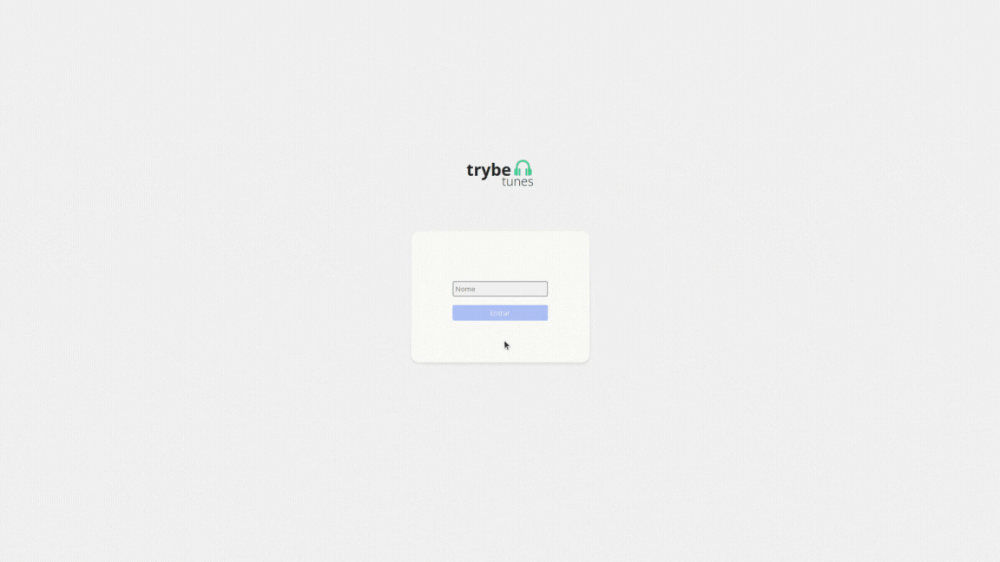

# Projeto Trybetunes

## Projeto Final


## Descrição do Projeto

Projeto desenvolvido durante meu aprendizado no curso de Desenvolvimento Web da [Trybe](https://www.betrybe.com/) (Módulo: Front-end). <br>

Nesse projeto coloco em prática o que aprendi sobre fazer requisições e consumir dados vindos de uma `API`, utilizar os ciclos de vida de um componente `React`, utilizar a função `setState` de forma a garantir que um determinado código só é executado após o `estado` ser atualizado, utilizar o componente `BrowserRouter` corretamente, criar rotas, mapeando o caminho da `URL` com o componente correspondente, via `Route`, utilizar o `Switch` do `React Router` e criar links de navegação na aplicação com o componente `Link`.

## Funcionalidades

O projeto oferece as seguintes funcionalidades:

- Fazer login;
- Pesquisar por uma banda ou artista;
- Listar os álbuns disponíveis dessa banda ou artista;
- Visualizar as músicas de um álbum selecionado;
- Reproduzir uma prévia das músicas deste álbum;
- Favoritar e desfavoritar músicas;
- Ver a lista de músicas favoritas;
- Ver o perfil da pessoa logada;
- Editar o perfil da pessoa logada.

Funcionalidades adicionais:

- Validação dos `inputs` com `Yup`;
- Efeito visual para saber se a entrada do `input` está correta ou não.

## Tecnologias Utilizadas

O projeto foi desenvolvido utilizando as seguintes tecnologias:
<p>
  
  
  
  
</p>

## Demostração do funcionamento do projeto


## Como Executar o Projeto

Para executar o projeto em sua máquina local, siga as etapas abaixo:

1. Clone este repositório:
```
git clone git@github.com:mtssantos96/project-trybetunes.git
```
2. Acesse o diretório do projeto:
```
cd project-trybetunes
```
3. Instale as dependências do projeto `npm install`;
4. Inicie o projeto usando o comando `ǹpm start`.

## Contribuição

Se você quiser contribuir para o desenvolvimento deste projeto, sinta-se à vontade para fazer um fork do repositório e enviar suas sugestões por meio de pull requests. Todas as contribuições são bem-vindas!

## Nota

Esse é o protótipo do esperado do projeto (protótipo criado pela [Trybe](https://www.betrybe.com/)):


# Obrigado pela visita :blue_heart:
